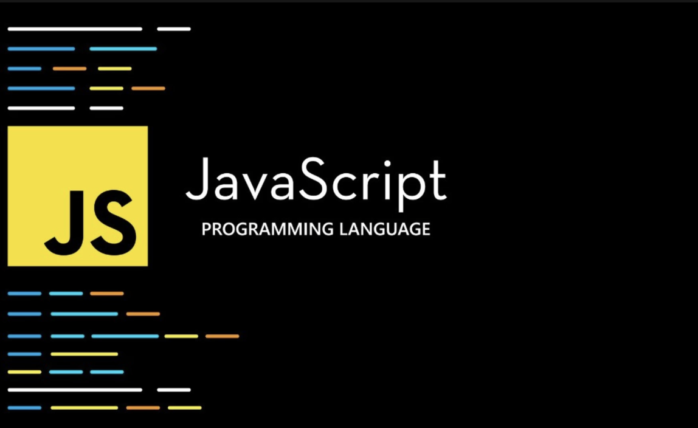

## Experience

While I can’t say that I’m new to coding or languages, I can admit that I was completely inexperienced with Javascript before taking my current Software Engineering course. Although the semester just started,  I immediately noticed that I personally found the language to be a bit easier than others.  I appreciate the simplicity of the language.  

## Thoughts
I think that Javascript is pretty cool so far. Also, I enjoy the concept of athletic software engineering. I haven’t done anything like it before in terms of coding. However, I have already noticed the benefits from practicing the WODs. Even when I don’t finish within the allotted time on the first try, I always reach a point where I can finish under average time. Being able to do this gradually definitely helps a lot. I appreciate this because I know that it will improve both my confidence and performance efficiency. 

## Conclusion

Although I am inexperienced when it comes to software engineering and web development, so far I have been really interested in this course. I hope that my interest continues, so that I can really get the most out of this course. I’m excited to learn as much as I can, and maybe it will play more of a role in my career path than I thought.
