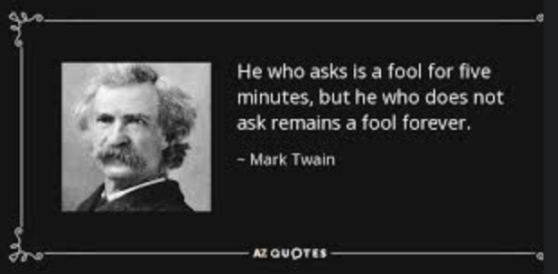

## Ask Dumb Questions, Get Dumb Answers

Everyone has heard the saying “There’s no such thing as a stupid question.” at least once before. However, my family also says, "Ask dumb questions, get dumb answers". While I do agree with the fact that it's always beneficial to ask questions, especially when you are trying to learn, I also think that there's always a tactful way to go about it.    

Eric Raymond's "How To Ask Questions The Smart Way", states that before asking a technical question you should:

1. Try to find an answer by searching the archives of the forum or mailing list you plan to post to.

2. Try to find an answer by searching the Web.

3. Try to find an answer by reading the manual.

4. Try to find an answer by reading a FAQ.

5. Try to find an answer by inspection or experimentation.

6. Try to find an answer by asking a skilled friend.

7. If you're a programmer, try to find an answer by reading the source code.

Before you ask a question, it's always best to exhaust all other resources first. Give it some effort and show that you gave it effort. Even if you don't find exactly what you're looking for while doing your own research, maybe you'll get one step closer, or even learn something new. Also, when you do ask your question, you'll potentially be able to provide more information to facilitate that smart question. 

## StackOverflow

StackOverlow even has its own [guidlines](https://stackoverflow.com/help/how-to-ask) to follow while trying to ask a question. I was able to find an example of a question that I believe is the smart way to ask a question. 

```
Q: How would you explain JavaScript closures to someone with a knowledge of the concepts they consist of (for example functions, variables and the like), but does not understand closures themselves?

I have seen the Scheme example given on Wikipedia, but unfortunately it did not help.
```

Although it could be seen as a bit broad, I feel as though this is a good question because of the way that it is structured. They have asked the question, given their extent of knowledge, and shown what they have already researched on the topic. They then expressed how their research had not helped their understanding.

```
A: A closure is a pairing of:

1. A function and
2. A reference to that function's outer scope (lexical environment)
A lexical environment is part of every execution context (stack frame) and is a map between identifiers (i.e. local variable names) and values.

Every function in JavaScript maintains a reference to its outer lexical environment. This reference is used to configure the execution context created when a function is invoked. This reference enables code inside the function to "see" variables declared outside the function, regardless of when and where the function is called.

If a function was called by a function, which in turn was called by another function, then a chain of references to outer lexical environments is created. This chain is called the scope chain.

```
 The answer goes on to provide uses, examples, and other resources pertaining to closures. It can be viewed on [StackOverflow](https://stackoverflow.com/questions/111102/how-do-javascript-closures-work). 

## Conclusion

All in all, asking questions isn't dumb, but there are smart ways to go about it. I've found myself asking a question and not getting the desired answer. Ultimmately, this just means that the intent behind the question wasn't interpreted correctly. An answer is only going to be as good as the question asked.
