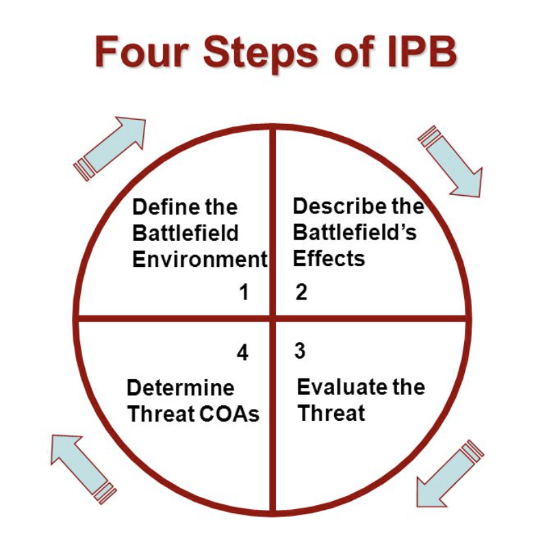

Advanced Leadership Course (ALC) is a course that all Sergeants (E-5) in the Army have to take in order to either become or maintain a Staff Sergeant (E-6). These courses are Military Occuptational Specialty (MOS) specific. As my MOS is an Intelligence Analyst (35F), I attended the 35F ALC.  

To give you a rundown of the course, here is an example of the expected course outcome:

<pre>
The 35F ALC trains and evaluates the skills necessary to prepare 35F Staff Sergeants to lead and train Soldiers and manage intelligence 
activities and resources as a multi- skilled technician in Large Scale Combat Operations (LSCO). The 35F ALC consists of four modules 
including NCO foundations, Pre-Deployment, Offensive Operations and Stability Operations. Throughout these modules students exercise the 
attributes and competencies of leadership with in a small group environment, while conducting analysis, developing intelligence products and 
delivering intelligence briefings. The primary outcomes from teaching these modules include: 

1) Analysis-level mastery of analysis of components of intelligence architecture. Students assess coordination requirements that are 
necessary for the successful execution of the intelligence architecture plan in a written examination. This assessment requires 70% on the 
rubric to pass. 
  
2) Evaluation-level mastery of development of an all-source training plan. Students work individually to develop a near term training plan 
in support of a deployment. This assessment requires a 70% on the rubric to pass. 

3) Evaluation-level mastery of analysis of information in support of shaping operations. Students will work as a BOE Intelligence Support 
Element to demonstrate their analysis of information in support of shaping operations in phase 1. This assessment requires a 70% on the 
rubric to pass. 
  
4) Evaluation-level mastery of drafting an intelligence estimate in support of shaping operations. Students individually draft an 
intelligence estimate. This assessment requires 70% on the rubric to pass. 
  
5) Evaluation-level mastery of revision of intelligence products in support of shaping operations for warfighting functions. Students 
demonstrate their ability to analyze information through presentation of a Battle Update Briefing and describe how their products support a 
movement and maneuver commander. This assessment requires a 70% on the rubric to pass.
</pre>

Source: <a href="https://mi.llc.army.mil/"><i class="large github icon "></i>mi.llc.army.mil</a>
