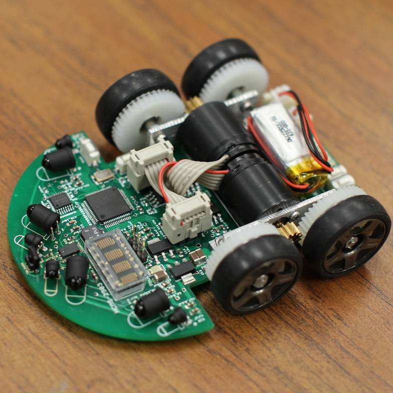

<div class="text-center p-4">
  
  
  
</div>

The 640th REGT hosts a 26.2 Mile Ruck March Challenge for students during their time while in attendance in any course. Each Soldier who chooses to take part in the REGT ruck challenge requires a $55 fee, and a 35lb ruck sack or backpack. Soldiers who register must complete a total of 26.2 miles throughout their stay on Camp Williams. All 26.2 miles do not need to be completed in one iteration; Soldiers can break up the distance into multiple iterations. Each Soldier who takes part in this challenge will receive a finisher’s medal at graduation, and a comment on their 1059 under the special projects or papers section.

```

You can learn more at the [UH Micromouse News Announcement](https://manoa.hawaii.edu/news/article.php?aId=2857).
