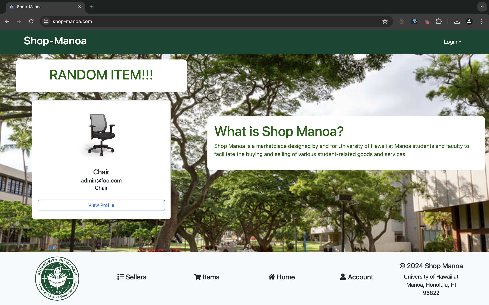

This semester while attending the University of Hawaii at Manoa, one of the courses that I had the pleasure of taking was ICS 314 Software Engineering. At the end of the course, with a group, we were assigned a final project. We had approximately a month to complete this project. For this assignment we had to use everything that we learned throughout the course, and apply it to build an application. 

Our group was assigned a Flea Market or Craigslist type of project. Taken directly from our <a href="https://shop-manoa.github.io/"><i class="large github icon "></i>Home Page</a>, here's our applications aim:

<pre>
The project, tentatively named “Shop-Manoa”, aims to address the rapid turnover of goods and services among students at the University of Hawaii at Manoa (UHM). The primary goal is to create an effective marketplace for campus-specific items, facilitating their recycling and reuse.

Shop-Manoa allows UHM students, faculty, and staff to buy and sell student-related goods and services. This platform is similar to Craigslist, with key differences including the requirement for UH credentials for all users, no anonymity, and the expectation of on-campus transactions.
</pre>

Overall, I enjoyed both the project and the process. I've never worked with a team in this capacity before. Being that of working on code with multiple other people to build something. There were definitely a few hiccups and things that we had to learn throughout the process, but I really enjoyed the experience.

Sources: 
- <a href="https://github.com/shop-manoa/shop-manoa"><i class="large github icon "></i>Shop-Manoa Deployment</a>
- <a href="https://github.com/shop-manoa/shop-manoa"><i class="large github icon "></i>Shop-Manoa Source Code</a>

 

