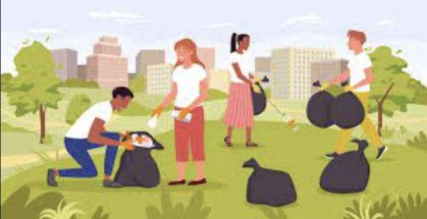

I attended Advanced Leadership Course (ALC) at Camp Williams, Utah in October of 2023. During this course, I coordinated and led a volunteer service project for myself and my peers. For this project, we went to clean the Veteran cemetery on base. We were tasked with picking up trash and just helping with overall beautification. 

This project helped me further practice both my leadership and organization skills.

 

